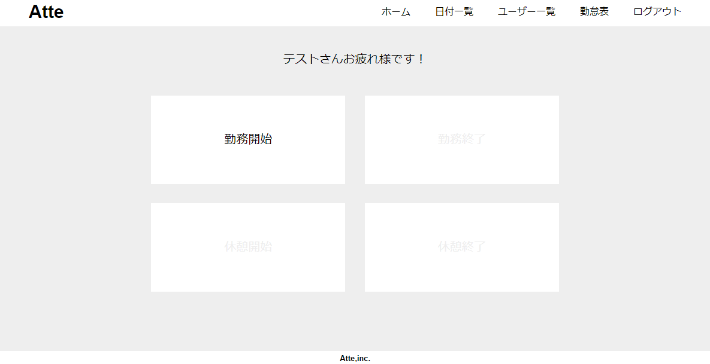
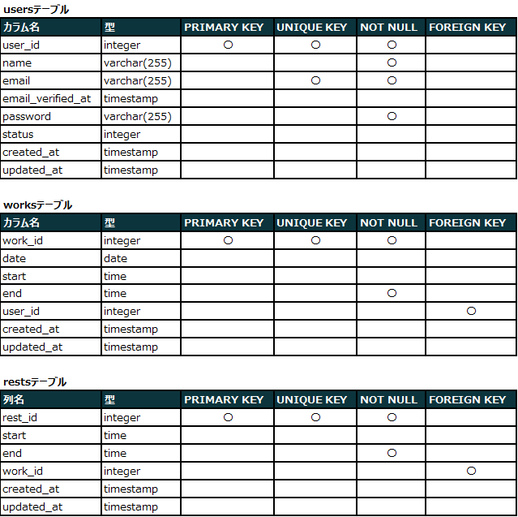
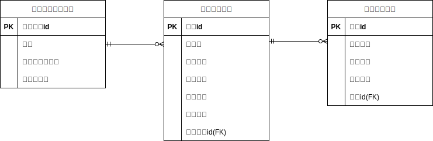

# 勤怠管理システム
勤怠管理システムを作成してみました。  
ログイン後、ボタン押下で勤務開始/終了時間と休憩開始/終了時間を管理します。  

## 作成した目的
勉強のアウトプットとして作成しました。

## アプリケーションURL
作成中

## 機能一覧
ログイン機能、勤務状態によるボタン制御、勤務時間/休憩時間管理、日付別勤怠管理、ユーザー別勤怠管理

## 仕様技術
Laravel 8.x

## テーブル設計

## ER図
